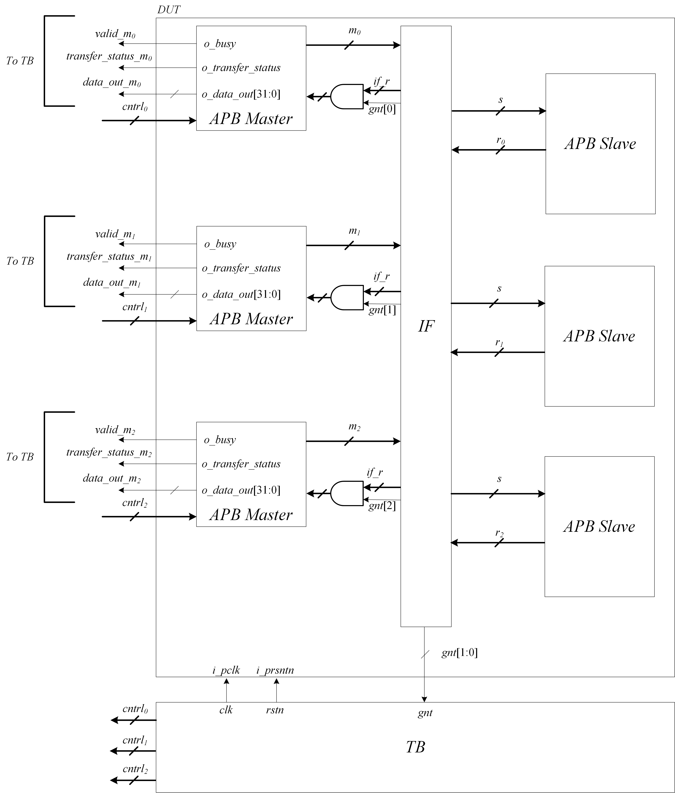
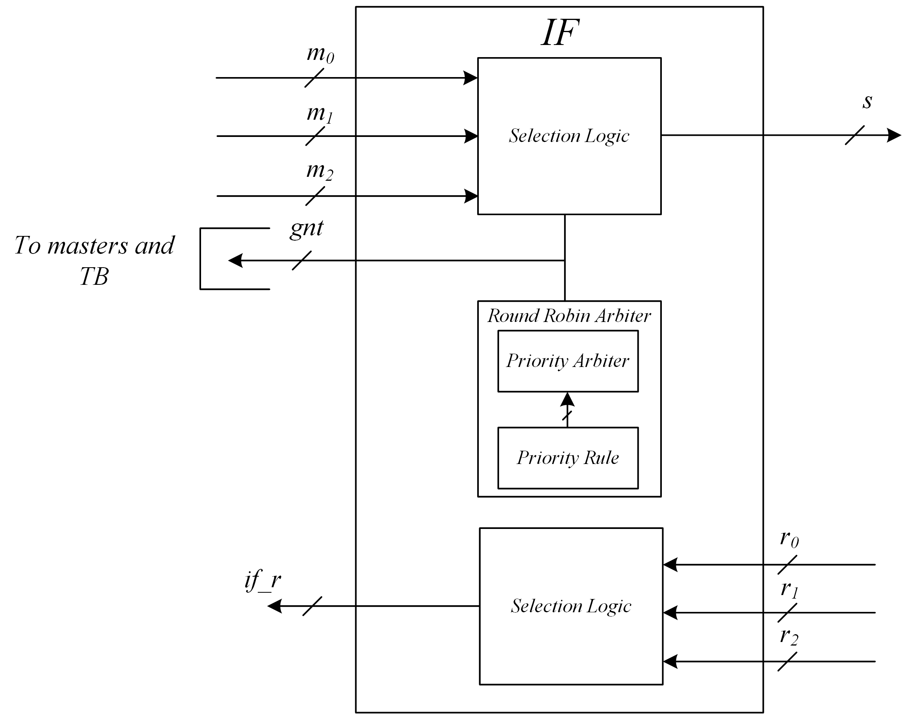
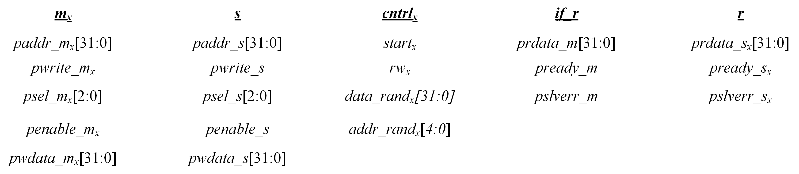
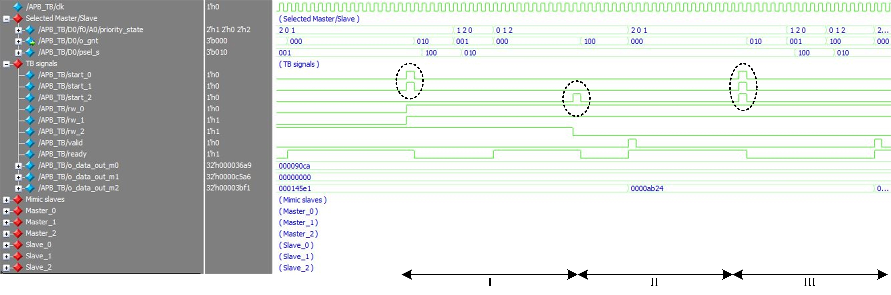
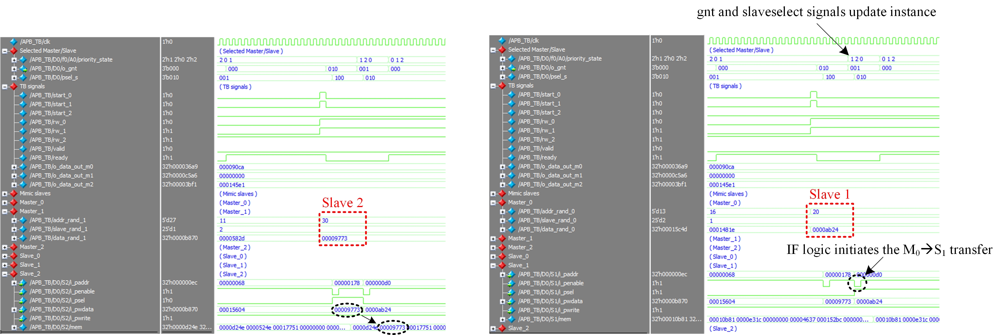
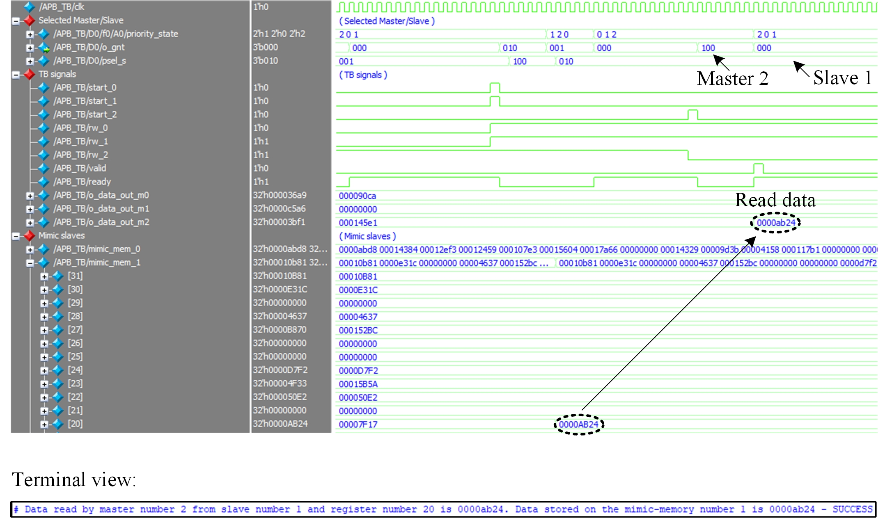

# SystemVerilog description of AMBA 

> Complete AMBA architecture and testbench in SystemVerilog - AHB side modules and AHB-APB bridge will be uploaded soon  

## Get Started

The source files for the APB side of the architecture:

- [APB_Master](./APB_Master.sv)
- [APB_Slave](./APB_Slave.sv)
- [APB Interconnect Fabric](./apb_interconnect_fabric.sv)
- [APB_DUT](./APB_DUT.sv)
- [APB_TB](./APB_TB.sv)
- [wave](./wave_apb.sv)

The source files for the AHB side of the architecture:

- XXX
- XXX

The source files for the AHB-APB bridge:

- XXX
- XXX

It is recomended to go over the various modules in the following order:
1. APB-side
2. AHB-side
3. AHB-APB bridge
4. Complete architecture
The following sections are written in this order.

Note: Please note that all transfers are initiated by dedicated tasks in the TB file. This is since the master and slave modules of the APB/AHB sides comprise the necessary logic to carry the AHB/APB protocol and perform read/write operations to a memory block within the slave modules.

## APB side 
Traditionally, APB has a single master which is aht AHB-APB bridge. Here,I have realized a multi-master multi-slave APB architecture for educational purposes (and fun). Of course, the single-maseter multi-salve case can be realized wihtout any modifications to the source code.
This side of the architecture comprises:
	-APB masters : number of masters on the bus can be configured in the source code
	-APB slaves : number of slaves on the bus can be configured in the source codes
	-Interconnect fabric (IF): manages the requesting masters' access to the APB slaves
	
A block diagram of the complete architecture is as follows:
	 

A block diagram of the APB side interconnect fabric is as follows:
	 

The APB IF manages the access to the APB slaves. In case of multiple transfer requests on the same clock edge the following is carried:
1. Access to the slaves is dictated by a 'modified' Round-Robin arbiter ('rotate-peiority-rotate' scheme). In this realization, the priority is maintained for masters that do not initiate a transfer.
For example: {M2 M1 M0}-->{M1 M2 M0} after M1 has initiated a transfer.
2. Requesting masters do not need to execute an additional request if they have not been granted access at first. The IF internally monitors all 'waiting' masters and automatically carries the transfer upon their turn.

The buses comprise the follwing signals:
	 

### APB side testbench

The APB side TB verifies the operation of the APB_DUT module which comprises instantiations of 3 APB masters and 3 APB slaves. The requesting masters, targeted slaves, memory addresses and data to be written are randomized and fed into the APB_DUT to initiate a single or multiple transfers. 

When a 'write' transfer is initiated, a mimiced memory is updated in the TB file with repect to the selected slave. 

When a 'read' transfer is initiated, the read data in the granted master is compared with the relevant mimic memory and address by calling the 'compare' task.

Let's go over some examplry bus operation:
	 

As can be seen, three 'events' are shown in the above section of the TB:
1. Two transfer requests by master_0 and master_1. Both masters initiate a 'write' command. The priority order is {M2 M0 M1} and therefore master_1 is granted access before master_0.
2. One transfer request by master_2. Mater_2 initiates a 'read' transfer.
3. Three transfer requests are given at the same clock edge. Master_0 and master_1 initiate a 'write' transfer while master_2 initiates a read transfer. 

I recomend running the TB and viewing all APB-related signals (psel,penable,etc.) as well as the slaves' memory arrays to get a better understanding of the flow. 

**Detailed view on the firt two events**
1.	First event
	 
As can be seen, the M1 transfer is carried first followed by the M0 transfer to S1 without any additional request carried by the losing master in the arbitration (M0).

2. Second event
	 

## Support

I will be happy to answer any questions.  
Approach me here using GitHub Issues or at tom.urkin@gmail.com